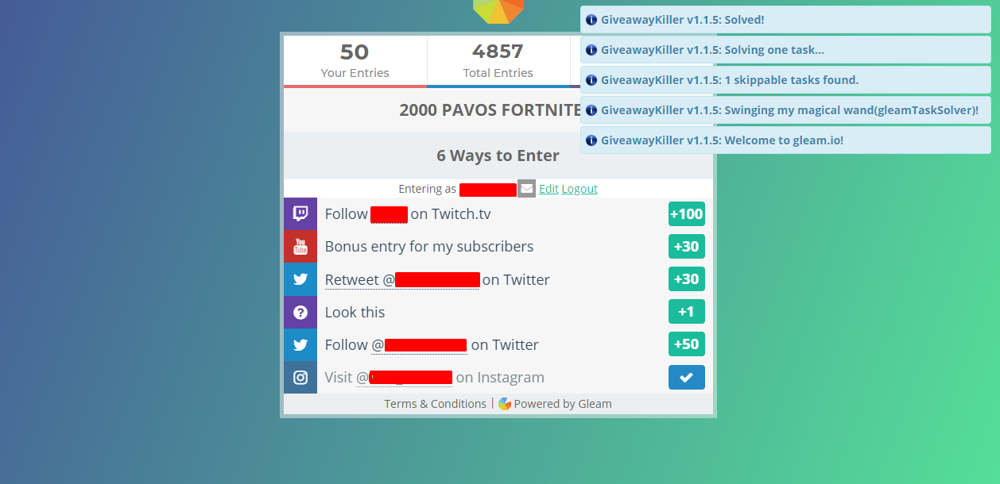

# GiveawayKiller
This script can automatically log in and solves/skips tasks on Steam-related giveaway websites. GiveawayKiller is the successor of the [Steam Giveaway Enhancer](https://github.com/gekkedev/giveawayHelperEnhancer). It also removes banners/popups if a giveaway site excessively uses them.

**Disclaimer: Any usage of this script may violate the Terms of Service of the sites it runs on. In most cases (especially when a website is violating the T.O.S of Steam) it is absolutely meant to do that. Use it at your own risk.**

## Installation
1. Google Chrome: Install [Tampermonkey](https://chrome.google.com/webstore/detail/tampermonkey/dhdgffkkebhmkfjojejmpbldmpobfkfo) or [Violentmonkey](https://chrome.google.com/webstore/detail/violentmonkey/jinjaccalgkegednnccohejagnlnfdag).  
Mozilla Firefox: Install [Greasemonkey](https://addons.mozilla.org/en-US/firefox/addon/greasemonkey/), [Tampermonkey](https://addons.mozilla.org/en-US/firefox/addon/tampermonkey/) or [Violentmonkey](https://addons.mozilla.org/en-US/firefox/addon/violentmonkey/).  
Opera: Install [this](https://addons.opera.com/en/extensions/details/install-chrome-extensions/) extension first, then you can install Tampermonkey, Greasemonkey, or Violentmonkey from the Chrome extension store.
2. Click [here](https://raw.githubusercontent.com/gekkedev/GiveawayKiller/master/giveawayKiller.user.js) and confirm your wish to install the Userscript.

By default, the script will automatically update every 24 hours (at least in Tampermonkey). If an update adds support for a new website, you may be asked for permission before the updated version gets installed.
